# User guide

A step-by-step guide for barangay staff: how to install the app, set it up, register
and print business clearances, and keep the records safe.

**Contents**

1. [Install and start the app](#1-install-and-start-the-app)
2. [Enter your barangay's details](#2-enter-your-barangays-details)
3. [Choose a printer](#3-choose-a-printer)
4. [Register a clearance](#4-register-a-clearance)
5. [Print a clearance](#5-print-a-clearance)
6. [Find, edit and delete clearances](#6-find-edit-and-delete-clearances)
7. [The dashboard](#7-the-dashboard)
8. [Reports](#8-reports)
9. [Back up your records](#9-back-up-your-records)
10. [Moving from the old desktop app](#10-moving-from-the-old-desktop-app)
11. [Using it from other computers or a phone](#11-using-it-from-other-computers-or-a-phone)
12. [Troubleshooting](#12-troubleshooting)

---

## 1. Install and start the app

You do this once on the office computer that will keep the records.

1. **Install Java 21 or newer.** Download the free "Temurin 21 (LTS)" installer for
   your system from <https://adoptium.net> and run it. On the installer's
   "Custom Setup" page, turn on **Set JAVA_HOME** and **Add to PATH**.
2. **Get the app file**, `bgyclearance.jar`, from whoever maintains it, or build it
   yourself (see the [README](../README.md#quick-start)).
3. **Make a folder for it**, for example `C:\BarangayClearance`, and put
   `bgyclearance.jar` there. Your records will be saved in this folder too, in a file
   called `clearances.db`.
4. **Make a start button.** In that folder, create a text file named
   `Start Clearance.bat` containing:

   ```bat
   @echo off
   cd /d "%~dp0"
   start "" http://localhost:8080
   java -jar bgyclearance.jar
   ```

   Double-click it. A black window opens (leave it open; closing it stops the app) and
   the app opens in your browser after a few seconds. If the browser shows "can't
   reach this page", wait a moment and press **F5**.
5. **Bookmark** <http://localhost:8080> in your browser.

> Tip: to start the app automatically, press **Win + R**, type `shell:startup`, and
> put a shortcut to `Start Clearance.bat` in the folder that opens.

The first time, the dashboard is empty and asks you to set up your barangay:

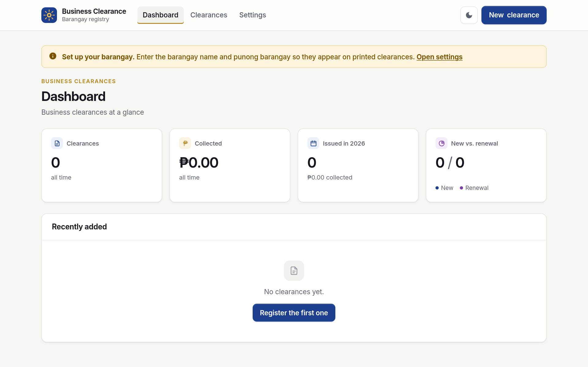

## 2. Enter your barangay's details

These are printed on the letterhead and signature lines of every clearance.

1. Click **Settings** at the top.
2. Fill in:
   - **Barangay name**, without the word "Barangay" (type `San Isidro`, not
     `Barangay San Isidro`).
   - **City / municipality** and **Province**, exactly as they should be printed, for
     example `Municipality of Liloan` and `Cebu`.
   - **Punong barangay**, for example `Hon. Ramon Cruz`.
   - **Barangay secretary** (optional). If filled in, a "Prepared by" signature line
     is added.
3. Click **Save settings**.

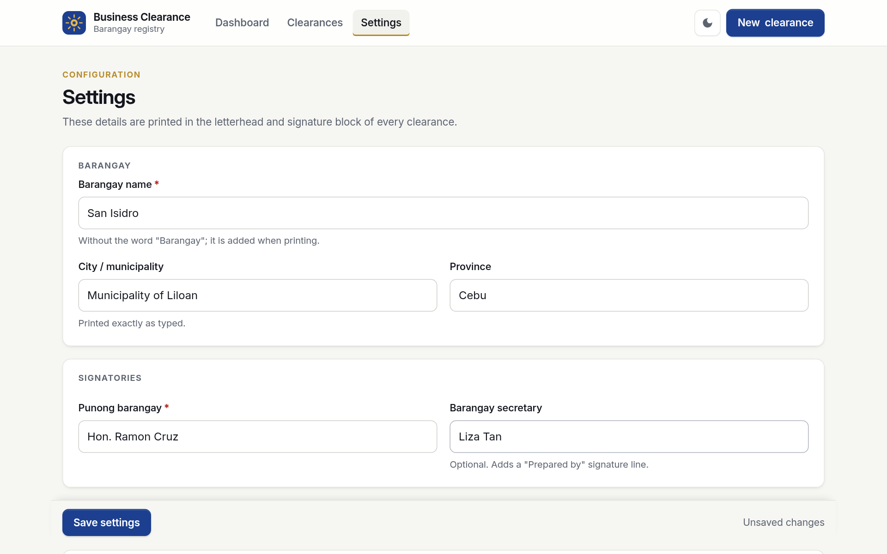

You can come back and change these at any time. Clearances you print afterwards use
the new details.

## 3. Choose a printer

Scroll down on the **Settings** page to **Printers**. The app lists:

- **Installed on this computer:** every printer already set up in Windows.
- **Found on the network:** printers the app found by itself on the office network.

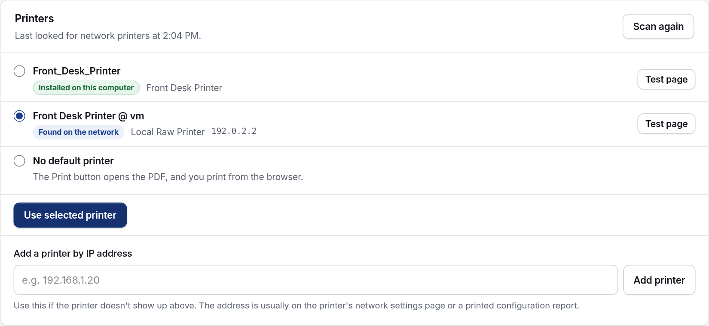

1. **Print a test page.** Click **Test page** next to the printer you want. A page
   should come out saying the printer works. If you get an error instead, see
   [Troubleshooting](#12-troubleshooting).
2. **Select that printer** and click **Use selected printer**. Clearances will now
   have a **Print to …** button for it.

**The printer isn't listed?**

- Make sure it is switched on and connected to the same network, then click
  **Scan again**. Scanning takes a few seconds.
- Or type its IP address under **Add a printer by IP address** (for example
  `192.168.1.20`) and click **Add printer**. The printer's IP address is usually shown
  on its own screen or on the network page it prints from its menu. Added printers
  have a **Remove** link.
- Or install it in Windows (**Settings → Bluetooth & devices → Printers & scanners →
  Add device**), then restart the app. It will appear under "Installed on this
  computer".

**Choose the paper.** Under **Paper size**, pick **Letter** (8.5 × 11 in) or **Long
bond** (8.5 × 13 in) and click **Save paper size**. Clearances, reports and test
pages all use it; load the same paper in the printer.

**Greyed-out printer that "doesn't take PDF files directly":** some network printers
only understand their own format. Install that printer in Windows with its driver, as
above, and choose it from the installed list instead.

You don't have to choose a printer at all: every clearance can also be opened as a
PDF and printed from the browser (see [step 5](#5-print-a-clearance)).

## 4. Register a clearance

1. Click **New clearance** (top right, on every page).
2. **Application**
   - **Type:** *New business* or *Renewal*.
   - **Control no.:** click the suggested number under the box ("Next available:
     2026007") to fill it in, or type your own. The app tells you if the number is
     already used by another clearance. `0` means "no number yet" and may repeat.
   - **Date issued:** today's date is filled in; change it if needed.
3. **Business**
   - **Business name** (required), as registered, e.g. `Tindahan ni Mang Tomas`.
   - **Address**, **Type of business / activity** (start typing to reuse one you
     entered before), **Capitalization**.
   - **Building:** *Owned*, *Rented* or *Not stated*.
4. **Ownership:** click every kind that applies (*Corporation*, *Single
   proprietorship*, *Partnership*, *Others*), and type the **Owner / manager**.
5. **Endorsement** (optional): the association the applicant belongs to, its
   president, and the 2nd endorsement number.
6. **Payment:** the **O.R. no.** and the **Amount paid** (required). You can type
   `250.5`, `1,250.50` or `₱1250.50`; it is tidied to `1,250.50` when you move on.
7. Click **Save clearance**, or press **Ctrl + S**.

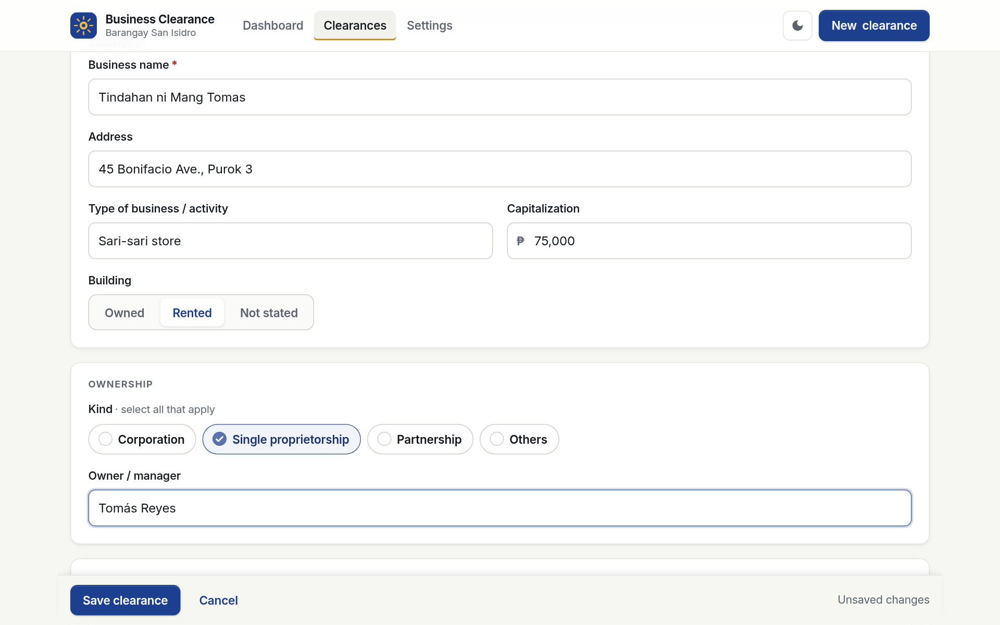

The form checks each box as you leave it. If something is wrong, the box turns red and
says how to fix it:

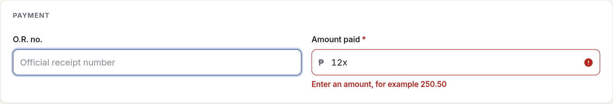

If you try to leave the page before saving, the browser asks first, so you don't lose
what you typed.

## 5. Print a clearance

After saving, you see the clearance:

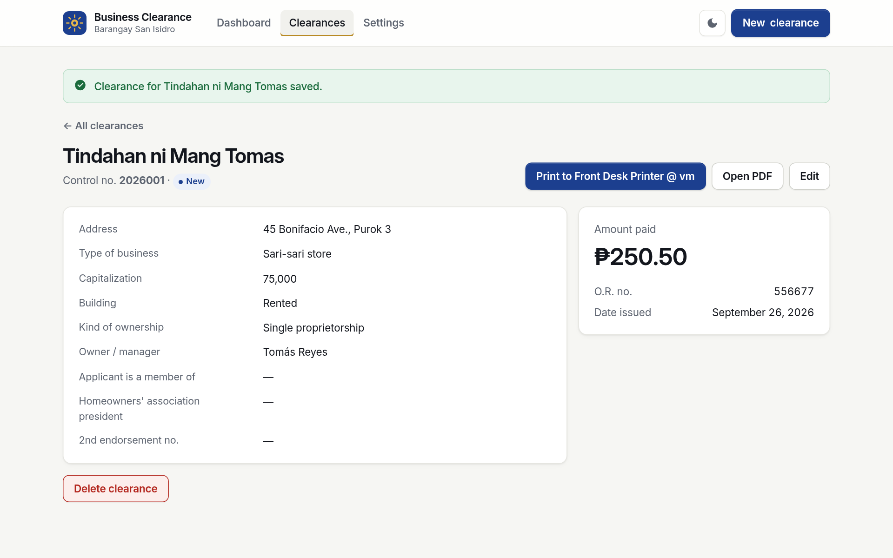

- **Print to *printer name*** sends it straight to the printer you chose in
  Settings. A message confirms it was sent.
- **Open PDF** opens the clearance in a new tab. Print it from there with
  **Ctrl + P**, or save it to send by email. Set the paper to the size chosen in
  Settings (**Letter**, or 8.5 × 13 in for long bond, which some printers call
  **Folio**) and the scale to **100%** / "Actual size".
- On the **Clearances** list, the **Print** button on each row opens the PDF too.

The printed clearance fits on one page:

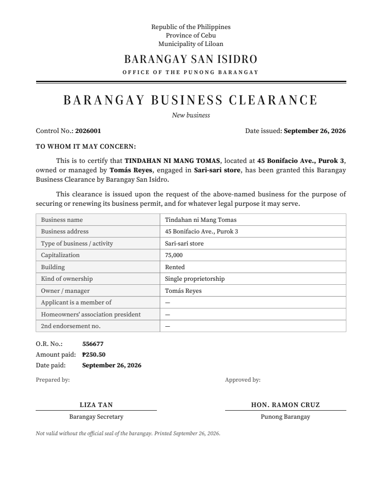

Sign it and stamp it with the barangay seal before releasing it.

## 6. Find, edit and delete clearances

Click **Clearances** at the top.

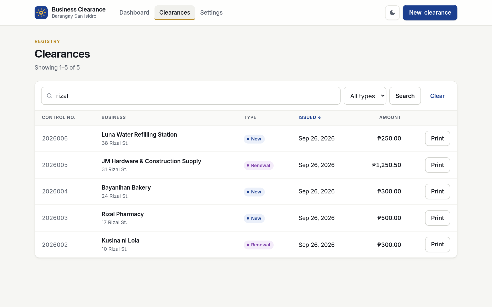

- **Search:** type part of a business name, address or control number and press
  **Enter** or click **Search**. **Clear** shows everything again.
- **Filter:** choose *New* or *Renewal* in the **All types** list.
- **Sort:** click a column heading (Control no., Business, Issued, Amount).
  Click it again to reverse the order.
- **More results:** 25 are shown at a time; use **Next →** and **← Previous** at the
  bottom.
- Click a business name to open that clearance.

**To correct a clearance**, open it and click **Edit**. Change what you need and click
**Save clearance**.

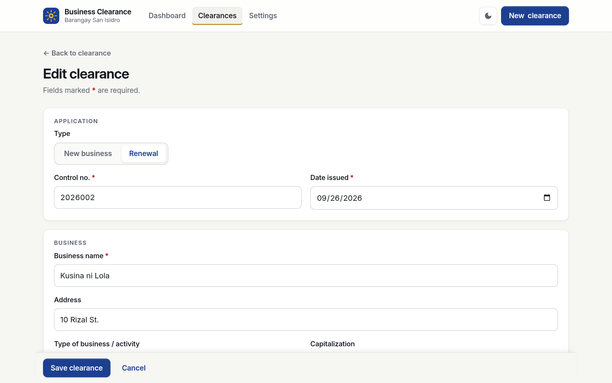

**To delete a clearance**, open it and click **Delete clearance** at the bottom of the
page, then confirm. This cannot be undone, so back up first if unsure.

## 7. The dashboard

Click **Dashboard** to see, at a glance, how many clearances have been issued in
total and this year, how much was collected, how many are new versus renewals, and
the most recently added clearances.

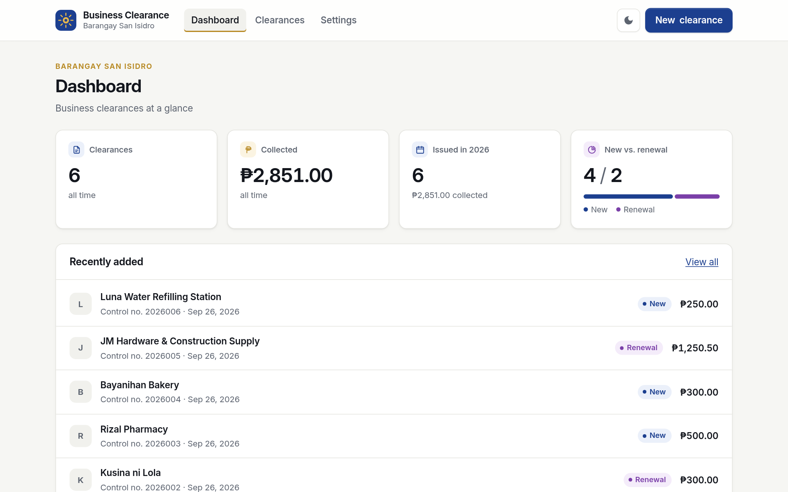

**Dark mode:** the moon button at the top right switches between light and dark. The
app remembers your choice on that computer.

## 8. Reports

Click **Reports** at the top to see what was issued and collected in a period: for a
monthly report to the municipal treasurer, an end-of-year summary, or to check the
day's collections before closing.

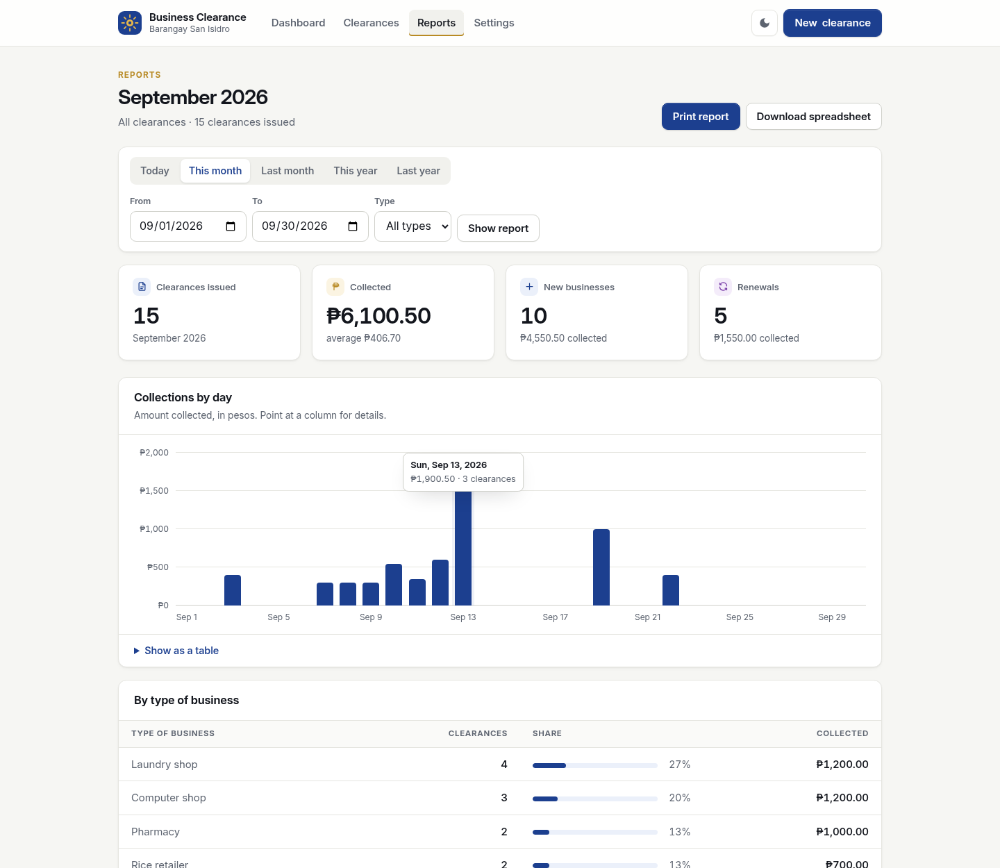

1. **Choose the period.** Click **Today**, **This month**, **Last month**, **This
   year** or **Last year**. For any other dates, set **From** and **To** and click
   **Show report**. The report opens on this month.
2. **Choose the type** (optional): *New* or *Renewal* in the **Type** list, then
   **Show report**. The quick period buttons keep this choice.
3. **Read the report.**
   - The totals at the top: clearances issued, amount collected (and the average),
     new businesses and renewals.
   - **Collections by day** (by month for longer periods, by year for very long
     ones): point at a column to see that day's amount and number of clearances.
     **Show as a table** lists the same figures.
   - **By type of business**: how many clearances each kind of business took, and
     how much they paid. Spelling and capital letters are ignored, so "Sari-sari
     store" and "sari-sari STORE" count together.
   - **Clearances issued**: every clearance in the period, oldest first, with the
     total at the bottom. Click a name to open it.
4. **Print or save it.**
   - **Print to *printer name*** sends it to the printer chosen in Settings.
   - **Open PDF** (or **Print report** if no printer is chosen) opens a printable
     report with the barangay letterhead and "Prepared by" and "Noted by"
     signature lines.
   - **Download spreadsheet** saves the clearances as a `.csv` file that opens in
     Excel or Google Sheets, one row per clearance, ready to sort, filter or add up.

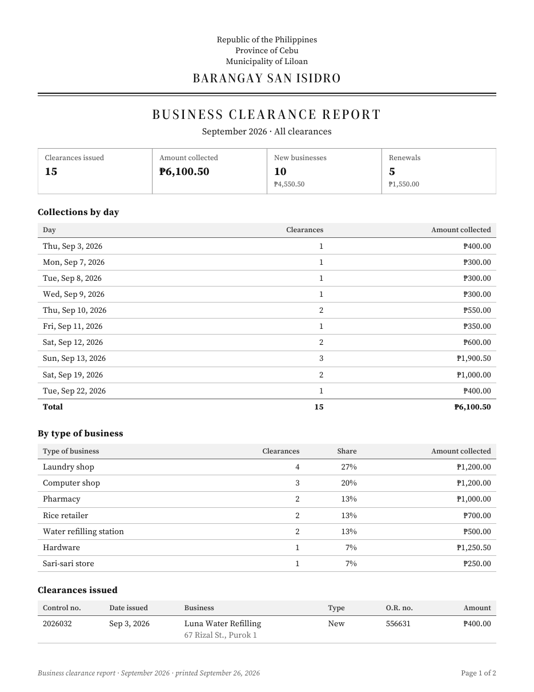

> Clearances from the old desktop app have no "date issued", so no report can place
> them. The Reports page tells you how many there are; open them from
> **Clearances**, click **Edit** and add the date to include them.

## 9. Back up your records

All records are in one file, `clearances.db`, in the app's folder.

1. Close the app's black window (this stops the app).
2. Copy `clearances.db` to a USB drive or another safe place. Adding the date to the
   name helps, e.g. `clearances-2026-09-26.db`.
3. Start the app again.

Do this at least once a week. **To restore**, stop the app, put the backup copy in the
app's folder, rename it to `clearances.db`, and start the app.

## 10. Moving from the old desktop app

Your old records can be used as they are.

1. Find the old database file (for example `SampleDB.db`) and **make a copy of it
   first**.
2. Put the copy in the app's folder and rename it to `clearances.db`.
3. Start the app. It updates the file on first start and keeps every record.

Old records have no "date issued", and many have no control number; they show "—"
for those. When you edit one, the app asks you to fill them in before saving.

## 11. Using it from other computers or a phone

By default, only the computer running the app can open it. To let other computers
or phones on the **same office network** use it:

1. Change the last line of `Start Clearance.bat` to:

   ```bat
   java -jar bgyclearance.jar --server.address=0.0.0.0
   ```

2. Restart the app. If Windows asks whether to allow Java on the network, allow it for
   **private** networks.
3. Find the computer's IP address: open Command Prompt, type `ipconfig`, and look for
   "IPv4 Address", e.g. `192.168.1.10`.
4. On the other device, open `http://192.168.1.10:8080`.

The screens adjust to phones and tablets. The app has no login, so anyone on the
network can use it: only do this on the office network, never on public Wi-Fi.

## 12. Troubleshooting

| Problem | What to do |
|---------|------------|
| The browser says "can't reach this page" | The app isn't running. Double-click `Start Clearance.bat` and wait a few seconds. If the black window closes immediately, Java isn't installed (step 1). |
| "'java' is not recognized…" | Java isn't installed, or wasn't added to PATH. Reinstall it with **Add to PATH** turned on, then restart the computer. |
| The black window says the port is already in use | The app is already running in another window, or another program uses port 8080. Close the other window, or add `--server.port=9090` to the last line and open `http://localhost:9090`. |
| "Could not connect to the printer" | The printer is off, asleep, or on another network. Switch it on, check its cable or Wi-Fi, and print a test page. |
| "The printer is busy" / "not accepting jobs" | Wait a moment and try again. Check the printer for paper jams or empty trays. |
| The printer isn't in the list | See [Choose a printer](#3-choose-a-printer): click **Scan again**, add it by IP address, or install it in Windows. |
| The printout is cut off or has two pages | Check **Settings → Paper size** matches the paper in the printer. When printing from the PDF, choose that paper and **100%** / "Actual size", not "Fit". |
| The barangay name is wrong on printouts | Correct it in **Settings** and print again. |
| "Control no. … is already used by …" | Each control number can be used once. Click the suggested number, or check the other clearance. |
| Records disappeared | The app was probably started from a different folder, so it opened a new, empty `clearances.db`. Always start it with `Start Clearance.bat` in the app's folder. Your records are still in the original file. |
